# App

ItecoTestApp is a mobile application, which was made as a test task.

## Screenshots

### Splash screen
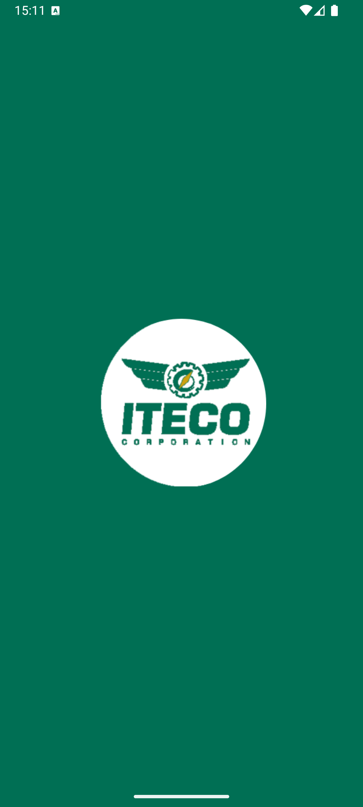

### Onboarding first subpage


### Onboarding second subpage

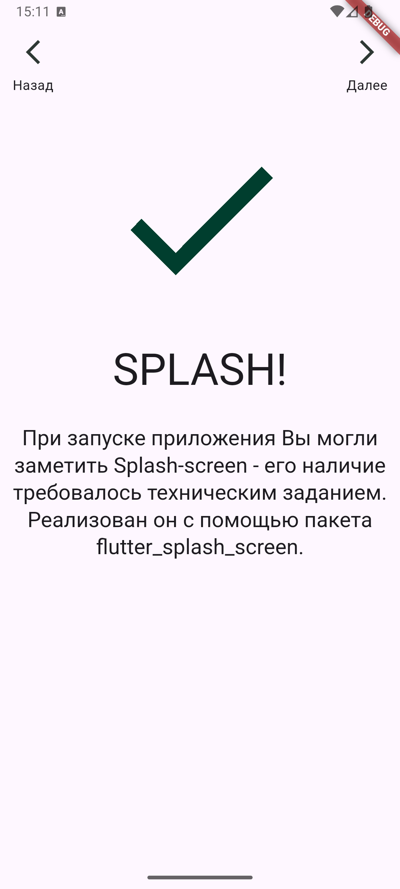
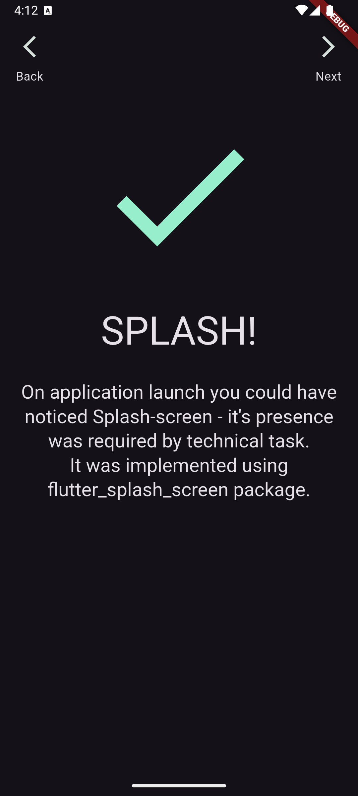

### Onboarding third subpage

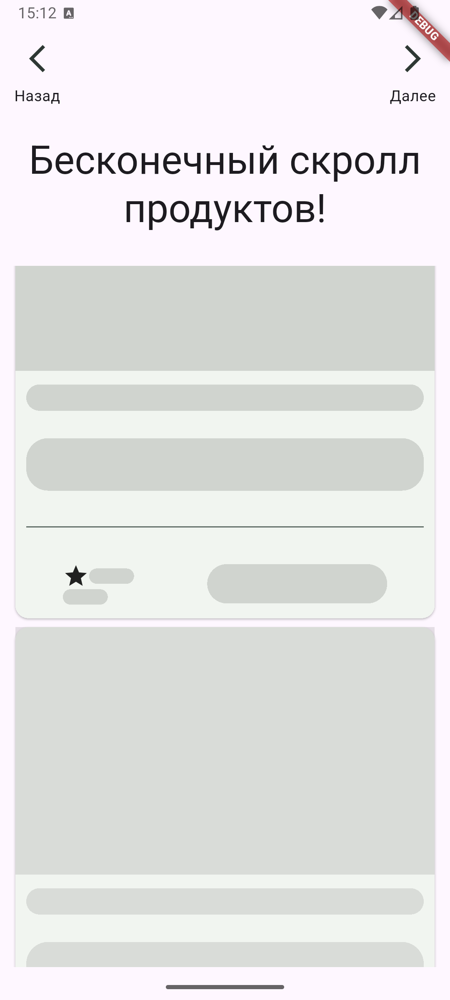
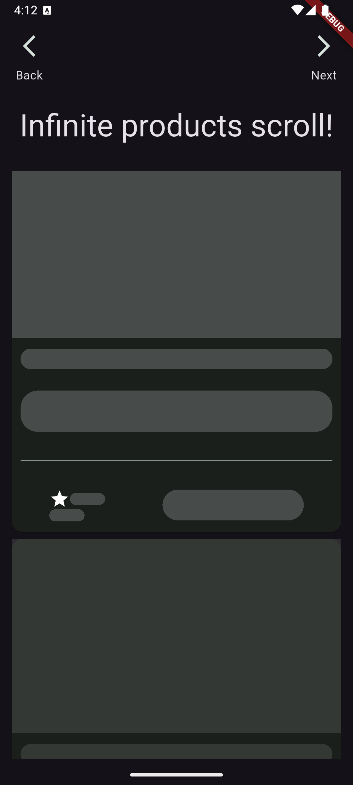

### Onboarding last subpage.


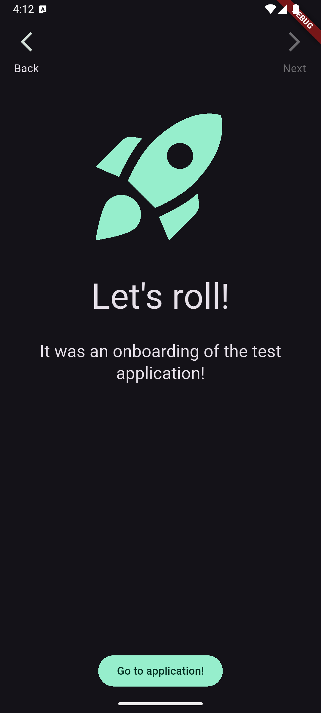

### Application home page

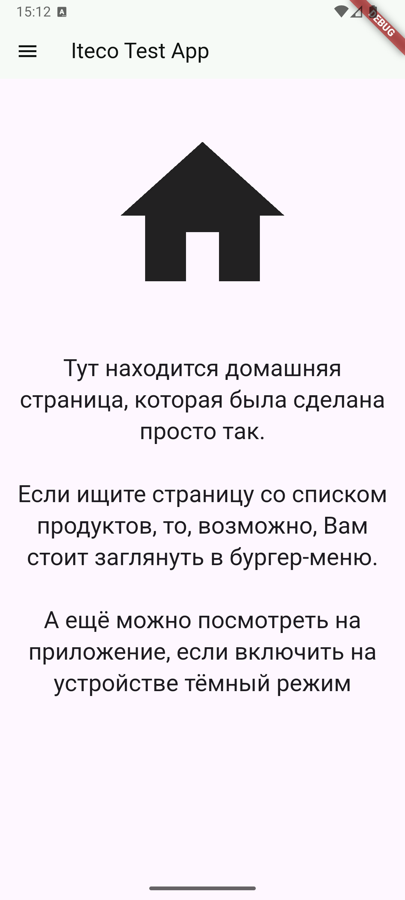
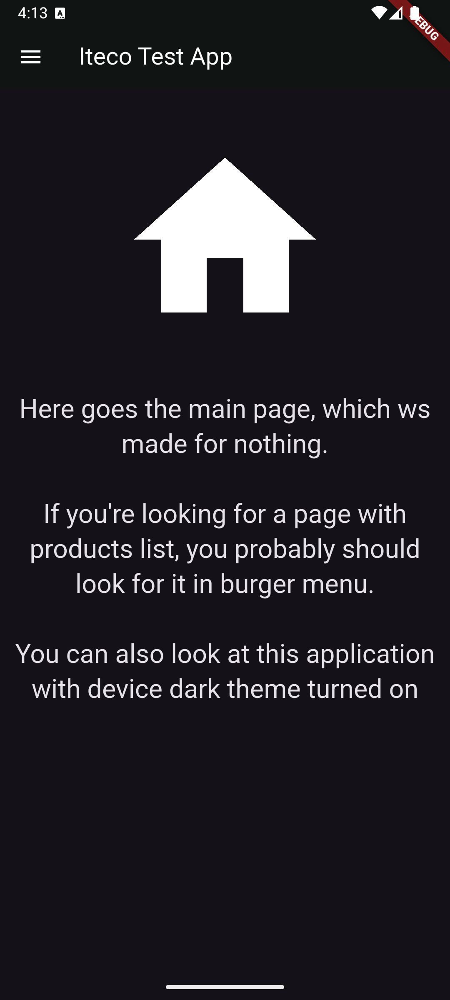

### By tap on burger menu icon, drawer shows up.
#### Let's tap go to products list.

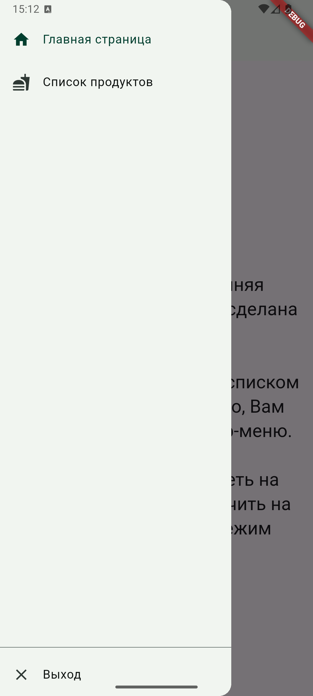
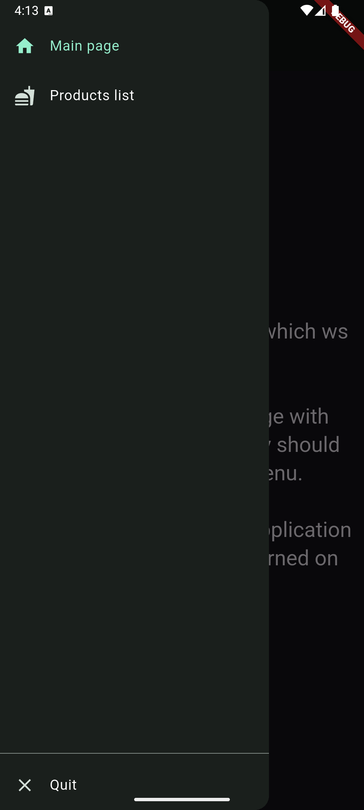

### Loading products list.

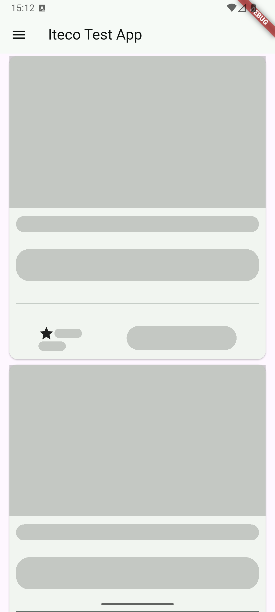
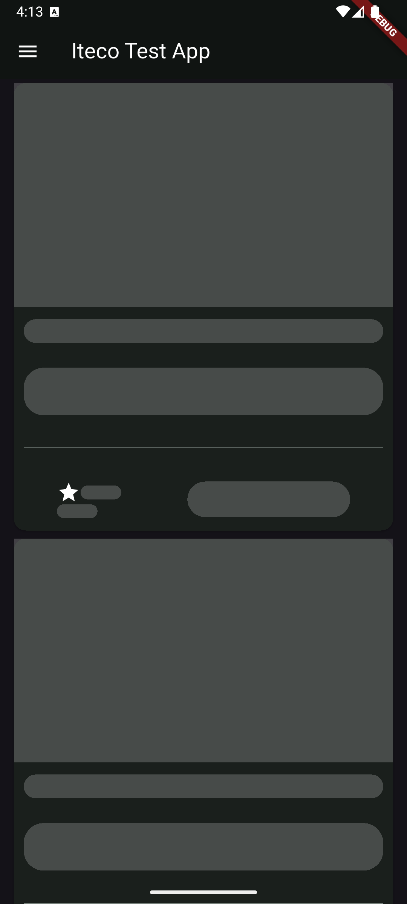

### Products list just got loaded.
Images of FakeStoreAPI don't load without a vpn.

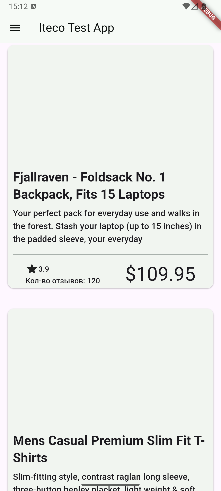
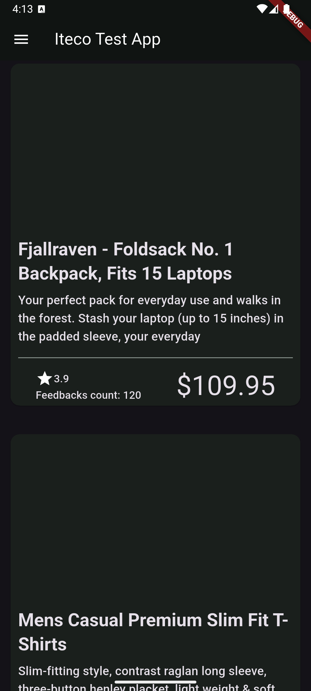

Other images load just fine. So to show, how product card should look like,
I used physical device with working vpn.

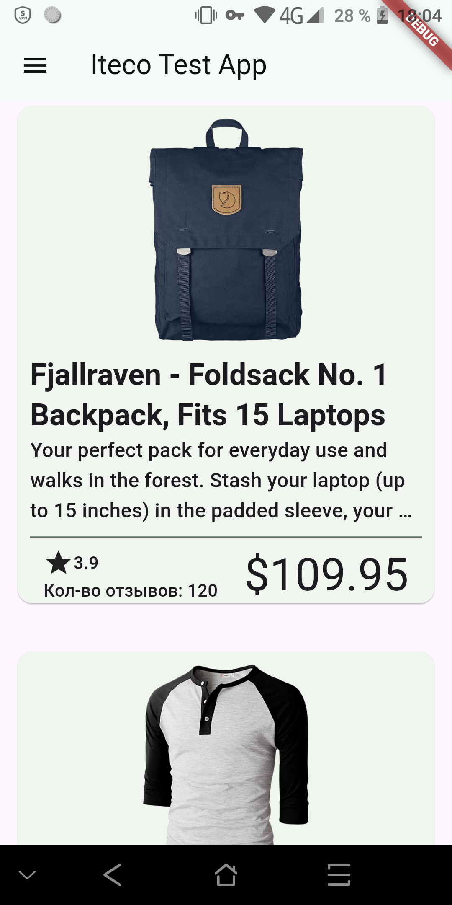


## Features

As technical task requires, this application has
 - Splash Screen
 - Onboarding page with several subpages. It shows up ony once, if it's first application launch.
 - Page with infinite scroll of products from FakeStore API.

This application also supports light and dark themes.
Russian and English locales are available.

MVVM approach was used on products feature only, coz other screens, such as onboarding and home, 
don't have any business logic, so there is no point to split code in separate files.
Despite that, I tried to keep their code clean.

## Used packages
- [Auto_route](https://pub.dev/packages/auto_route) for routing.
- [Dio](https://pub.dev/packages/dio) + [Retrofit](https://pub.dev/packages/retrofit) for Rest Api.
- [Elementary](https://pub.dev/packages/elementary) for making screens according to MVVM approach.
- [Intl](https://pub.dev/packages/intl) for i18n and l10n.
- [Flutter_native_splash](https://pub.dev/packages/flutter_native_splash) for Splash screen.
- [Provider](https://pub.dev/packages/provider) for DI.
- [Shared_preferences](https://pub.dev/packages/shared_preferences) for storing persistent data.
- domain for models and abstractions as inner layer of onion architecture.

## Getting Started

Before you start this application, make sure you have a JSON configuration file in root.
It's structure is presented below:
```json
{
  "iteco_test_server_url": "https://fakestoreapi.com",
  "iteco_test_environment_name": "dev",
  "iteco_test_application_name": "Iteco Test App",
  "iteco_test_first_launch_key": "iteco_test_first_launch_key",
  "iteco_test_products_pagination_size": 3
}
```

It's not safe to store this file in git, but this time, as it's a test app, I will.

Also don't forget to mention this file in run script with flag `--dart-define-from-file=iteco_app_config.env.json`

If you're using AndroidStudio, you can run app, using 'Dev' run config.
